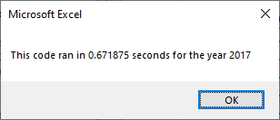
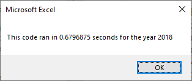
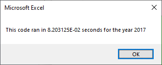
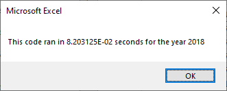

# Stock Analysis  - Module 2 Challenge

## Overview of Project

The purpose of this project is to analyze comparisons of a newly refactored code for running on a stock analysis using VBA in Excel. The code will be compared using the run time as the indicator of performance to observe the efficency of the two methods of the stock analysis, as a more efficent code would be ideal when more values and years may be analyzed then just these specific tickers and years.

## Analysis and Results

### Analysis of Refractored Changes
 

As a part of this analysis, one of the bigger changes was the use of more variables defined as arrays for the analysis, compared to the original code that tended towards using more loops and temporary variables to output calculated values immediately to the "All Stock Analysis" worksheet. An example of the code is shown below.

```
    tickerVolumes(tickerIndex) = tickerVolumes(tickerIndex) + Cells(i, 8).Value
    
    If Cells(i - 1, 1).Value <> tickers(tickerIndex) And Cells(i, 1).Value = tickers(tickerIndex) Then
       tickerStartingPrices(tickerIndex) = Cells(i, 6).Value
    End If
    
    If Cells(i + 1, 1).Value <> tickers(tickerIndex) And Cells(i, 1).Value = tickers(tickerIndex) Then
        tickerEndingPrices(tickerIndex) = Cells(i, 6).Value
        tickerIndex = tickerIndex + 1
    End If
```
TickerVolumes, tickerStartingPrices and tickerEndingPrices are all new arrays used for the analysis in order to keep the data stored until later outputting to the analysis sheet.

In the original analysis, the code would activate the "All Stock Analysis" Worksheet in each loop to output the data and return to the yearly worksheet, but storing the values in an array means it can be stored an only switch worksheets once done.

### Results of Refractored Changes using Timer

The analysis for both code processes matched, and the times were recorded using the timer function as shown.
```
startTime = Timer

...

endTime = Timer
MsgBox "This code ran in " & (endTime - startTime) & " seconds for the year " & (yearValue)

```

The original code produced these results for 2017 and 2018.



The refactored code produced these results for 2017 and 2018.



Comparing the results, it is shown that the refactored code was in fact faster then the original code.


## Summary

- What are the advantages or disadvantages of refactoring code?

A main advantage of the refractoring process is to make the code more efficient, and potentially easily applied to future analyses that may use more data - whether that means carrying out the analysis for more data points or years. While the difference this time was within a second and may seem unnecessary for an optimization, if more data is to be analyzed, or if the analysis is performed on a less powerful computer, the process should be as fast and efficient as possible as the difference between the methods will be more then within a second of difference.

One disadvantage of refactoring code is sometimes the original code can best reflect the thought process of the original creator, making it easier to look at and understand. However, a lot of these issues can be handled with proper commenting to explain the differences in process and the logic behind it - as what might be more efficient for VBA may not be the way a user would efficiently process the data in a physical means.

- How do these pros and cons apply to refactoring the original VBA script?

While the new script was noticeably faster, both analyses were still completed in under a second which may not matter to the average user. However, this code may be used by different people on different computers, or analyzed with millions of data points rather then a few thousand. In which case, making the code more efficient to read the stock data will save more time and be more noticable to the client or other users. Hence, the refactored code is a good improvement

One part of the original code that comes to mind for the analysis is how the data from the VBA analysis was moved to the "All Stock Analysis" worksheet. It is similar to how I might do an analysis by hand: calculating the data for one ticker, then writing the totals down in the analysis. As such, when reading the code, it is easy for me to understand how it works and exactly what it is doing. The refractored code calculates all the ticker data, remembers it all, then writes it down in the sheet after, which does not immediately come to mind as something I might do. However, proper commenting to explain the process can ensure that the code remains easy to understand.
